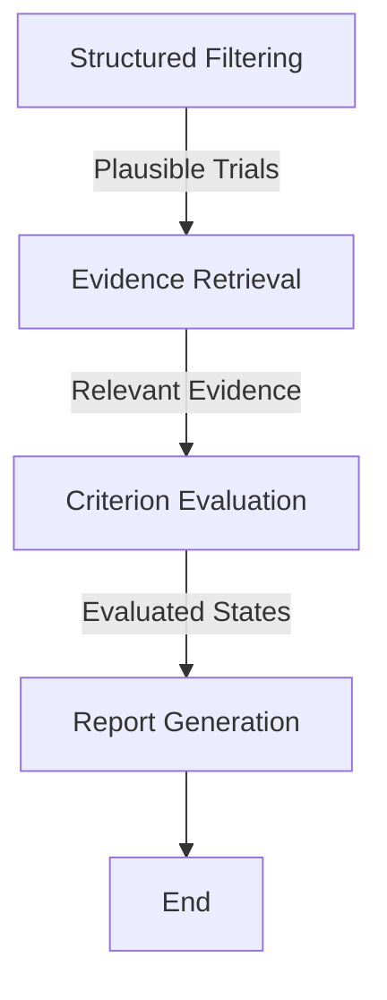

# Type 2 Diabetes Clinical Trial Pre-Screening Agent

## Library Desk Analogy
Imagine the pre-screening agent as a librarian organizing index cards. On one desk, there are cards detailing the patient's history (diagnoses, medications, lab results). On another desk, there are cards detailing trial requirements. The librarian first quickly filters out the trial cards that are closed for recruitment or strictly age-incompatible (Structured Filtering). Then, for the remaining trials, they retrieve specific relevant fact cards from the patient's desk and criteria cards from the trial's desk (Evidence Retrieval). Next, they compare these pairs of cards meticulously, categorizing the match as Supported, Not Supported, Unknown, Conflicting, or requiring a head librarian's review (Criterion Evaluation). Finally, they compile a shortlist of the top three most promising trials, along with the evidence cards attached, and leave them in a neat folder for the clinical research coordinator to make the final call (Report Generation).

## Architecture & Design Choices
- **Framework**: LangGraph is used to define an explicit, step-by-step state machine with four clear stages: Structured Filtering, Evidence Retrieval, Criterion Evaluation, and Report Generation.
- **State Schema**: The agent maintains a state dictionary tracking `patient_id`, `patient_data`, `trials`, `filtered_trials`, `evidence`, `evaluations`, and `report`.
- **Retrieval (RAG)**: A mock in-memory retrieval is set up to preserve source identifiers. It matches patient facts with trial criteria instead of dumping the whole JSON into the context.
- **Decoupled Evaluation**: Clinical fit and recruiting status are evaluated separately, preserving the specific states (SUPPORTED, NOT_SUPPORTED, etc.).

## Setup Instructions
1. Ensure Python 3.10+ is installed.
2. Run `pip install -r requirements.txt`.
3. To run the single patient end-to-end vertical slice: `python agent.py`
4. To run the evaluations: `python evals.py`

## Known Limitations
- The current implementation provides a structural vertical slice using rule-based mocks for the LLM evaluation to ensure it runs immediately without an API key. To fully utilize an LLM, the `evaluate_criteria` node would need a real LangChain LLM instance injected.
- The evidence retrieval relies on basic metadata matching rather than a full vector database due to time constraints, but demonstrates the architectural boundary.

## Intended Graph & Architecture
The agent follows an explicit directed graph designed to separate concerns:

## State Schema
The explicit state object passed between nodes ensures transparent checkpoints:
- `patient_id`: Identifier of the current patient
- `patient`: Full structured and unstructured patient data
- `trials`: Full collection of trials
- `filtered_trials`: Trials passing initial deterministic age/status filters
- `evidence`: Specific RAG-retrieved chunks of patient and trial data
- `evaluations`: Dictionary mapping trial ID to evaluated criteria (`SUPPORTED`, `UNKNOWN`, etc.)
- `report`: The generated text output for the clinical research coordinator

## Unfinished Nodes & Remaining Risks
- **Unfinished Node - Full LLM Integration in Criterion Evaluation**: Currently mocked to guarantee deterministic execution for reviewers without API keys. To complete this, an LLM call with strict JSON output parsing (to force the 5 expected criterion states) must be added.
- **Unfinished Node - RAG Pipeline**: Currently retrieves by simple dictionary key. Should be extended to use a real local vector store like ChromaDB chunked by criterion boundaries.
- **Remaining Risk - Hallucination of Evidence**: Even with restricted context, an LLM might misinterpret conflicting lab result dates.
- **Remaining Risk - Dataset Coverage**: Patients with missing eGFR or HbA1c may incorrectly trigger `NOT_SUPPORTED` instead of `UNKNOWN` if the LLM isn't perfectly prompted.

## Evaluations to Add Next
- **Context Relevance Score**: Did the retrieval step fetch the correct lab date for HbA1c?
- **Agent Behavior Tests**: Test if the graph correctly halts and returns `REQUIRES_CLINICAL_REVIEW` when a complex criterion (like nested cardiovascular history) appears.
- **State Transition Assertions**: Unit tests verifying that no `UNKNOWN` state gets converted into a negative answer during Report Generation.
