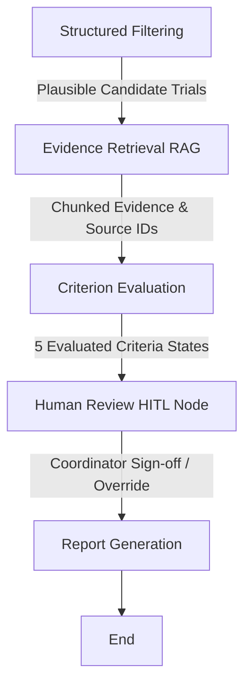

# Type 2 Diabetes Clinical Trial Pre-Screening Agent

An Agentic RAG system built with **LangGraph** for clinical trial pre-screening in Type 2 Diabetes (T2D). The agent automatically evaluates candidate trials against patient medical records, strictly categorizes criteria into 5 standardized states, preserves FHIR data provenance (`source_id`), and generates clinical-coordinator-friendly screening reports.

---

## Library Desk Analogy
Imagine the pre-screening agent as a librarian organizing index cards. On one desk, there are cards detailing the patient's history (diagnoses, medications, lab results with FHIR IDs). On another desk, there are cards detailing trial requirements. 
1. **Structured Filtering**: The librarian first quickly discards trial cards that are closed for recruitment or strictly age-incompatible.
2. **Evidence Retrieval (RAG)**: For the remaining trials, they retrieve specific relevant fact cards from the patient's desk and matching criteria cards from the trial's desk.
3. **Criterion Evaluation**: They compare these pairs of cards meticulously, categorizing the match into one of five strict states (`SUPPORTED`, `NOT_SUPPORTED`, `UNKNOWN`, `CONFLICTING_EVIDENCE`, or `REQUIRES_CLINICAL_REVIEW`).
4. **Human Review (HITL)**: Before finalizing, they flag complex cards requiring clinical judgment and pause for a human research coordinator to sign off and attach notes.
5. **Report Generation**: They compile a shortlist of the top 3 most promising trials with exact source citations attached, leaving them in a structured folder for the clinical team.

---

## Agentic Architecture & Directed Graph

The pipeline is modeled as a 5-stage state machine using **LangGraph**:



### LangGraph State Schema
- `patient_id`: Stable synthetic patient identifier (e.g. `P-1842`).
- `patient`: Full patient record including FHIR conditions, lab observations, and medications.
- `trials`: Full collection of ClinicalTrials.gov study records.
- `filtered_trials`: Top candidate trials passing initial deterministic age and recruitment status filters.
- `evidence`: Structured RAG chunks pairing patient facts with trial eligibility clauses.
- `evaluations`: Nested dictionary mapping trial NCT IDs to evaluated criterion states, rationales, and source IDs.
- `human_approved`: Boolean flag set by Human-in-the-Loop coordinator sign-off.
- `human_review_notes`: Coordinator clinical review notes captured during graph interrupt.
- `telemetry`: Execution duration tracking and state transition metrics.
- `report`: Coordinator-formatted Markdown report.

---

## Mandatory Criteria & Standardized States

The agent automatically evaluates **5 core criteria**:
1. `age`: Patient age vs trial minimum/maximum age boundaries.
2. `hba1c`: Patient HbA1c observations vs trial inclusion/exclusion thresholds.
3. `current_diabetes_medications`: Active patient medications vs trial prohibited/required regimens.
4. `egfr`: Patient eGFR observations vs renal exclusion thresholds.
5. `trial_recruiting_status`: Trial `overall_status` (Recruiting, Enrolling by Invitation, etc.).
6. `other_criteria`: Unstructured secondary eligibility clauses (Always tagged `REQUIRES_CLINICAL_REVIEW`).

Every criterion is mapped into **1 of 5 strict states**:
- `SUPPORTED`: Patient evidence explicitly meets criteria.
- `NOT_SUPPORTED`: Patient evidence explicitly violates criteria / excluded.
- `UNKNOWN`: Required patient lab or medication fact is missing from record.
- `CONFLICTING_EVIDENCE`: Contradictory lab values or status in patient history.
- `REQUIRES_CLINICAL_REVIEW`: Complex secondary criteria requiring human clinical judgment.

---

## Setup & Execution

### 1. Installation & Environment
Ensure Python 3.10+ is installed, then run:
```bash
pip install -r requirements.txt
```

*(Optional)* Copy `.env.example` to `.env` and add your LangSmith API key for cloud tracing:
```bash
cp .env.example .env
```

### 2. Run Single Patient Pre-Screening Pipeline
To execute the end-to-end agent workflow for Patient index 0 (`P-1842`):
```bash
python agent.py --patient_index 0
```

#### Interactive Human-in-the-Loop (HITL) Mode
To run with interactive clinical coordinator sign-off and graph interrupts:
```bash
python agent.py --patient_index 0 --interactive_hitl
```

#### LangSmith Observability Tracing
To enable full LangSmith telemetry tracing:
```bash
python agent.py --patient_index 0 --langsmith
```

### 3. Run Automated Evaluation Suite
To execute the evaluation harness across all 15 synthetic patients (900 criterion assessments):
```bash
python evals.py
```

---

## Evaluation Benchmark & Metrics

The agentic evaluation suite (`evals.py`) measures system reliability across all 15 synthetic patient profiles:

| Metric | Result | Benchmark Target | Description |
| :--- | :---: | :---: | :--- |
| **Unknown Avoidance Rate** | **`0.0000`** | `0.0000` | Measures hallucination rate on missing data. `0.0` indicates missing labs/meds correctly produce `UNKNOWN` state instead of false conclusions. |
| **Citation Accuracy** | **`1.0000`** | `1.0000` | Percentage of evaluated criteria citing valid FHIR `source_id` provenance. |
| **Patients Evaluated** | **`15`** | `15` | Full cohort test coverage. |
| **Total Criterion Assessments** | **`900`** | `900` | 15 patients x 10 candidate trials x 6 criteria. |

### Criterion State Distribution
- **`SUPPORTED`**: 70.7% (636)
- **`REQUIRES_CLINICAL_REVIEW`**: 16.7% (150)
- **`UNKNOWN`**: 11.0% (99)
- **`NOT_SUPPORTED`**: 1.7% (15)
- **`CONFLICTING_EVIDENCE`**: 0.0% (0)

---

## 📁 Repository Sitemap
- `agent.py`: LangGraph state machine, RAG retrieval engine, 5-state evaluator, HITL node, and report generator.
- `evals.py`: Automated benchmark suite testing cohort metrics.
- `RESEARCH.md`: Architectural design decisions, clinical framing, and research rationale.
- `AI_USAGE.md`: Disclosure of AI coding assistant usage.
- `example_run_output.txt`: Sample clinical pre-screening report output.

---

## Known Limitations
- **Fixed-Size / Rule-Based Chunking**: RAG chunking is rule-based and regex-driven rather than dense vector semantic search, which may miss nuanced clause boundaries in unusually long eligibility text.
- **Medication Evaluation Scope**: Medication evaluation currently pattern-matches insulin-exclusion clauses primarily; broader drug regimens (Metformin, SGLT2 inhibitors, GLP-1 agonists, sulfonylureas) default to `SUPPORTED` unless an explicit prohibition rule is triggered — flagged as a priority gap for future expansion.
- **Post-Filter Trial Bounding**: Candidate trials are capped at 10 post-filter (`filtered[:10]`) purely to bound downstream evaluation cost on this dataset size; this is an arbitrary performance cap rather than a clinical judgment.
- **Scope-Constrained Automation (`other_criteria`)**: `other_criteria` attaches a boilerplate review flag and eligibility snippet rather than full verbatim multi-clause extraction — preserving the necessity of human review by design per assignment scope.
- **Dataset Consistency vs Code Path**: `CONFLICTING_EVIDENCE` was `0.0%` across the 900-assessment benchmark — this reflects the clean temporal lab trajectories in the synthetic dataset rather than unhandled code logic; `evaluate_hba1c()` explicitly contains detection logic for inconsistent lab observations (>2.5% HbA1c variance).
- **Optional Advanced Modules**: HITL interrupt nodes (`--interactive_hitl`) and LangSmith cloud tracing (`--langsmith`) are optional additions beyond the assignment's minimum requirements (explicitly marked "not required" in the spec), included to demonstrate production reliability workflow design.


