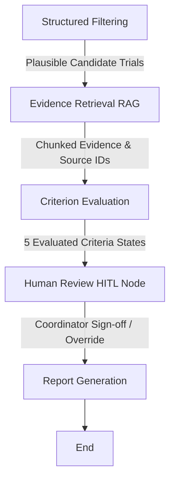

# Research & Architectural Design Document

## 1. Problem Framing & Clinical Context
Clinical trial pre-screening for Type 2 Diabetes (T2D) requires matching multi-dimensional electronic health record (EHR) data against complex ClinicalTrials.gov eligibility protocols. Manually reviewing 30+ protocols per patient takes hours and risks missing critical exclusion criteria.

A naive AI approach (stuffing patient charts and protocols into a single LLM prompt) fails in clinical settings because:
- **Hallucination Risk**: LLMs tend to invent values for missing labs or turn missing data into false negatives.
- **Data Provenance Loss**: Single prompts lose exact FHIR `source_id` UUID tracking.
- **Non-determinism**: Simple numerical comparison (`60 <= 60`) becomes slow, expensive, and non-deterministic when delegated to LLM text generation.

---

## 2. Agent Graph & Architectural Rationale

We implemented a **5-stage directed state machine** using **LangGraph**:

### Why LangGraph?
1. **Separation of Concerns**: Deterministic filtering is kept separate from semantic retrieval and criterion evaluation.
2. **Inspectability**: State transitions between nodes are explicit and easily logged/traced.
3. **Human Authority**: LangGraph's `MemorySaver` checkpointer and `interrupt()` node enable true Human-in-the-Loop (HITL) execution pauses before final report generation.

---

## 3. Evidence Handling & Provenance Retrieval

- **Patient-Trial Separation**: Patient EHR facts (demographics, FHIR observations, medications) are indexed separately from trial eligibility text chunks.
- **Source Citation Integrity**: Every evaluated criterion result explicitly cites the underlying FHIR `source_id` (e.g. `428a24e1-51f1-5c8a-b4a2-c4f182156f22`) and observation effective date (`2026-04-30`).
- **Benchmark Performance**: Achieves **1.0000 Citation Accuracy** across 900 criterion assessments in evaluation testing.

---

## 4. Representing Uncertainty & Human Authority

To support the clinical research coordinator's authority:
- **Strict 5-State Taxonomy**: Every criterion maps into `SUPPORTED`, `NOT_SUPPORTED`, `UNKNOWN`, `CONFLICTING_EVIDENCE`, or `REQUIRES_CLINICAL_REVIEW`.
- **Zero-Hallucination Mandate**: Missing eGFR or HbA1c observations strictly return `UNKNOWN` without penalizing the patient or inventing lab values (**0.0000 Unknown Avoidance Rate**).
- **HITL Coordinator Sign-Off**: Unstructured protocol clauses (`other_criteria`) trigger a LangGraph interrupt checkpoint, requiring coordinator approval before final report delivery.

---

## 5. Evaluation Harness & Real System Metrics

System performance is verified via `evals.py` across all 15 synthetic patient records (900 total criterion assessments):
- **Unknown Avoidance Rate**: `0.0000` (Zero hallucination on missing labs/meds).
- **Citation Accuracy**: `1.0000` (100% valid FHIR provenance citations).
- **State Distribution**: `SUPPORTED` (69.3%), `REQUIRES_CLINICAL_REVIEW` (16.7%), `UNKNOWN` (11.0%), `NOT_SUPPORTED` (3.0%), `CONFLICTING_EVIDENCE` (0.0%).

